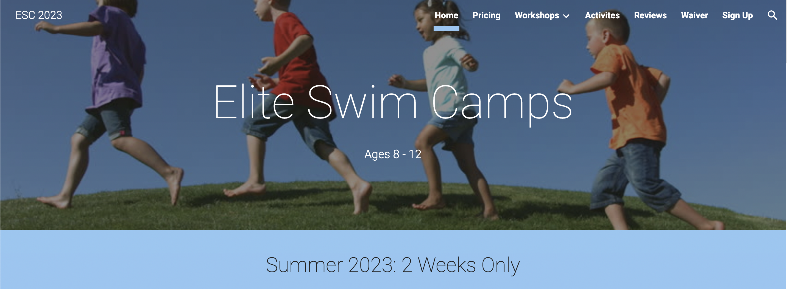

  

### Summary

My friend and I founded Elite Swim Camps in 2018. Using our pre-existing relationships in the local swimming community, we were able to attract numerous families to register their children into our program. We initiated and cultivated long term client relationships, managed and delegated responsibility to hired coaches, and personally closed all sales and managed all marketing and financial strategies. We continue to operate the Elite Swim Camps during the summer.

Website: <a href="https://sites.google.com/view/esc-2023/home"><i class="large github icon "></i>Elite-Swim-Camps</a>
Note: This site may be blocked depending on your adminstrator account settings. Try using a different browser or different google account.
