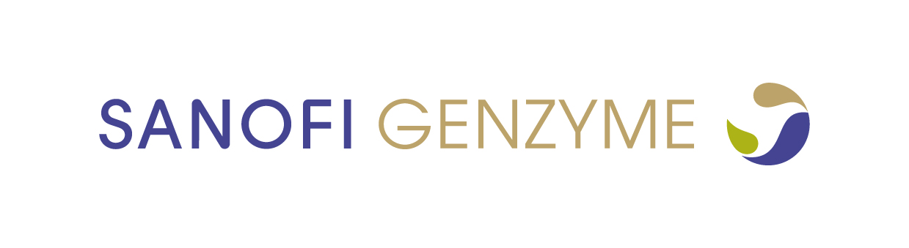

  

### Executive Summary

Following a $69 per share tender offer from Sanofi-Aventis to acquire Genzyme and an open letter to Genzyme shareholders expressing their frustration with Genzyme executives, the Genzyme Board of Directors must determine through a quantitative and qualitative analysis what the Genzyme corporation is worth. Quantitatively, the market-based valuation values Genzyme at $71.80 per share and the management-based valuation values Genzyme at $90.89 per share. Pipeline revenues are the key difference between these valuations. The qualitative analysis provides support for management’s perspective and discusses other qualitative value of Genzyme from Sanofi’s perspective including drug diversification, market penetration, and complementary patent cliffs. It is recommended that the Genzyme Board of Directors counteroffer Sanofi-Aventis with management’s valuation of $90.89 per share and otherwise address the concerns of its shareholders.

Full Analysis: <a href="https://github.com/JustinLisoway/JustinLisoway.github.io/blob/main/projects/Lisoway-Genzyme.pdf"><i class="large github icon "></i>Lisoway-Genzyme-Case-Study</a>
